# Cliniqly — Use Case Flow Diagrams

Visual reference for all 50 scenarios (SC-1 through SC-50) across 12 categories.

**How to view:** Paste any code block into [mermaid.live](https://mermaid.live), or open this file in GitHub / VS Code with "Markdown Preview Mermaid Support" extension / Notion.

---

## Diagram Index

| # | Diagram | Scenarios |
|---|---|---|
| 1 | System Overview — All Channels and Actors | All |
| 2 | WhatsApp New Patient Booking — Full Sequence | SC-1, SC-2, SC-3, SC-4, SC-5 |
| 3 | Returning Patient via WhatsApp | SC-6, SC-7, SC-8, SC-9 |
| 4 | Web Booking Link | SC-10, SC-11, SC-12 |
| 5 | Cancellation Flows | SC-13, SC-14, SC-15, SC-16, SC-17 |
| 6 | Walk-in and Manual Entry | SC-18, SC-19, SC-20, SC-21, SC-22 |
| 7 | No-show and Post-Visit | SC-23, SC-24, SC-25, SC-26 |
| 8 | Reminder and Communication Failure — Sequence | SC-27, SC-28, SC-29 |
| 9 | Capacity and Plan Limit Enforcement | SC-30, SC-31, SC-32 |
| 10 | Clinic Onboarding and Setup | SC-33, SC-34, SC-35, SC-36 |
| 11 | Multi-Role Access Control | SC-37, SC-38, SC-39 |
| 12 | Plan Trial and Upgrade | SC-40, SC-41 |
| 13 | Reports and Exports | SC-42 through SC-50 |
| 14 | Role-Based Access (RBAC) Summary | FR-33, FR-44 |

---

## 1. System Overview — All Channels and Actors

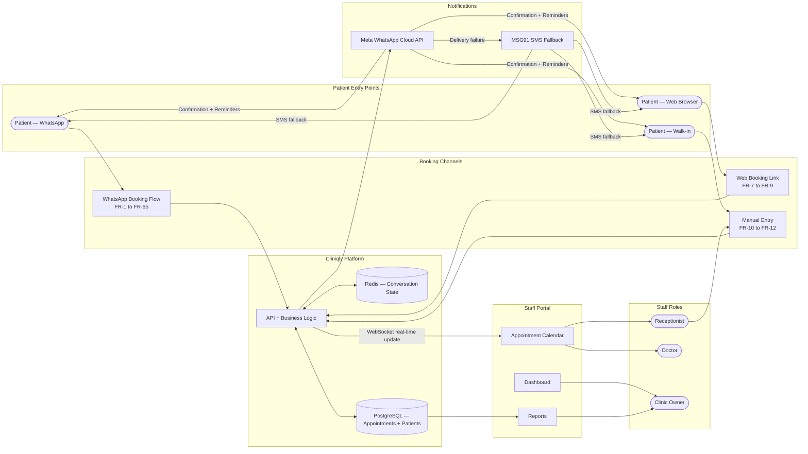

---

## 2. WhatsApp New Patient Booking — Full Sequence (SC-1 through SC-5)

*Covers: happy path (SC-1), 30-min timeout/abandonment (SC-2), invalid input (SC-3), no slots today (SC-4), after-hours booking (SC-5).*

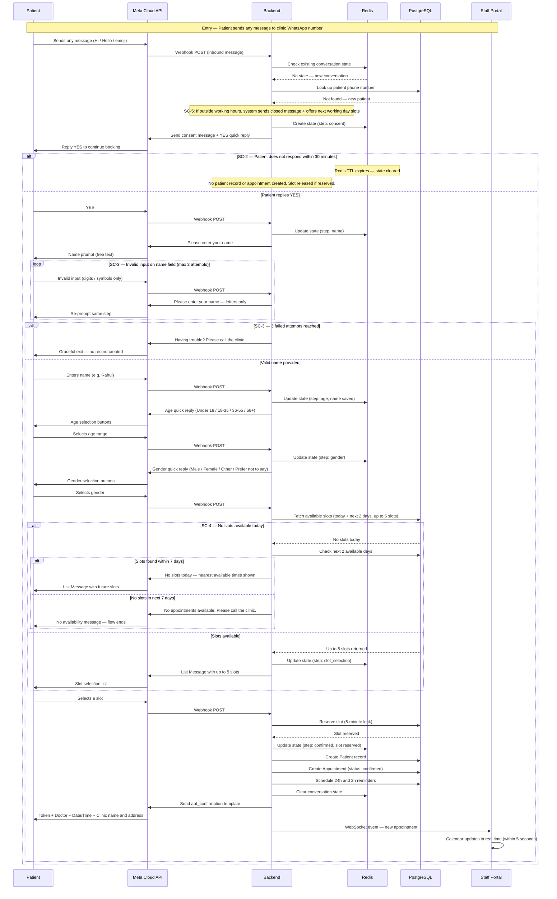

---

## 3. Returning Patient via WhatsApp (SC-6 through SC-9)

*Covers: recognised returning patient fast-track (SC-6), patient already has appointment today (SC-7), prior no-show on record (SC-8), web booking with phone match (SC-9).*

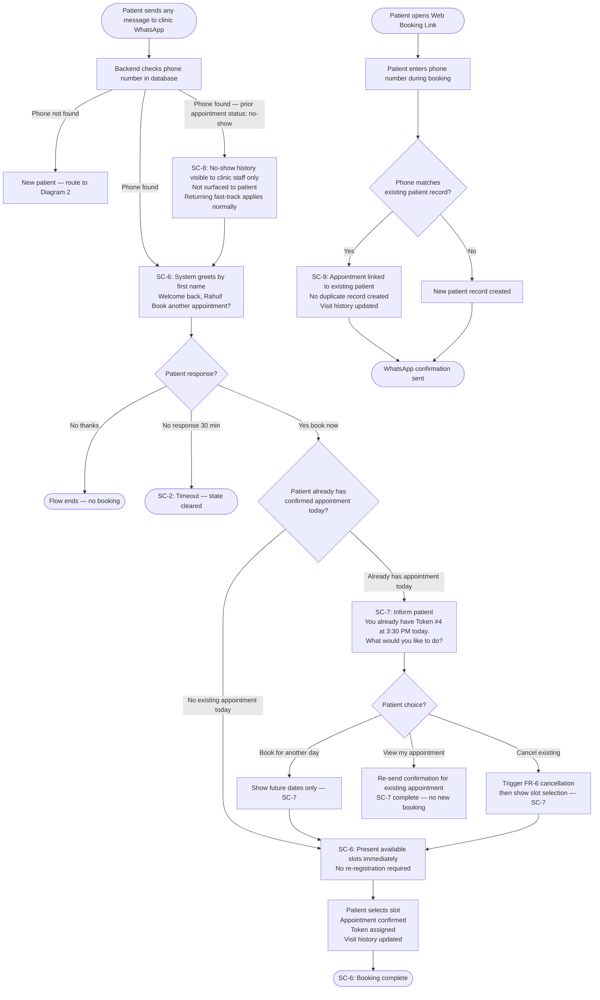

---

## 4. Web Booking Link (SC-10 through SC-12)

*Covers: new patient without WhatsApp — SMS fallback (SC-10), slot conflict during booking (SC-11), clinic has no available slots (SC-12).*

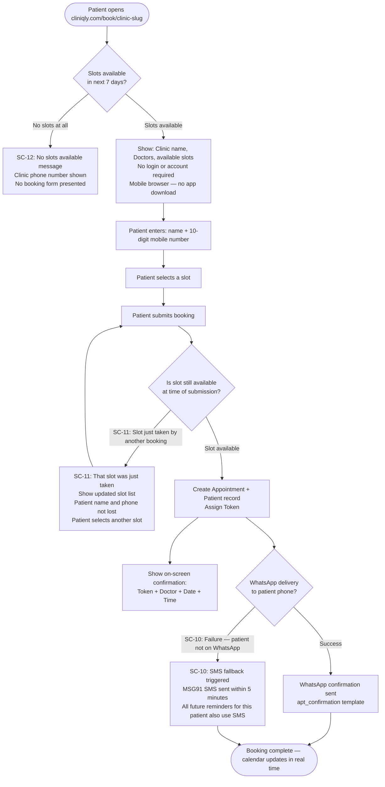

---

## 5. Cancellation Flows (SC-13 through SC-17)

*Covers: cancel via 24h reminder (SC-13), cancel via 2h reminder (SC-14), cancel attempt after appointment has passed (SC-15), staff cancels on behalf of patient (SC-16), patient tries to cancel an already-cancelled appointment (SC-17).*

```mermaid
flowchart TD
    subgraph PATIENT_CANCEL["Patient-Initiated Cancellation (SC-13, SC-14, SC-15)"]
        PC_START([Patient receives WhatsApp reminder]) --> WHICH{Which reminder?}
        WHICH -->|24-hour reminder| SC13[SC-13: Patient taps Cancel appointment quick reply]
        WHICH -->|2-hour reminder| SC14[SC-14: Patient replies CANCEL — case-insensitive]

        SC13 --> TIME_CHK{Appointment time<br>in the future?}
        SC14 --> TIME_CHK

        TIME_CHK -->|Yes| DO_CANCEL[Cancellation acknowledgment sent to patient<br>Appointment status: cancelled<br>Slot returns to available<br>Receptionist calendar updates in real time]

        TIME_CHK -->|No — appointment already passed| SC15["SC-15: This appointment has already passed.<br>No status change. No action taken."]
    end

    subgraph STAFF_CANCEL["Staff-Initiated Cancellation (SC-16)"]
        SC_START([Receptionist opens appointment — taps Cancel]) --> NOTIFY{Send WhatsApp notice<br>to patient?}
        NOTIFY -->|Yes| SC16_Y[SC-16: Cancellation WhatsApp sent<br>Appointment: cancelled<br>Slot: available<br>Modification logged with staff role + timestamp]
        NOTIFY -->|No| SC16_N[SC-16: Silent cancellation<br>No message sent<br>Modification still logged]
    end

    subgraph DOUBLE_CANCEL["Double-Cancel Prevention (SC-17)"]
        DC_START([Patient sends CANCEL]) --> STATUS_CHK{Appointment<br>current status?}
        STATUS_CHK -->|Already cancelled| SC17["SC-17: Your appointment is already cancelled.<br>Book anytime by messaging us.<br>No action taken — no duplicate"]
        STATUS_CHK -->|Confirmed — valid cancellation| DO_CANCEL2[Normal cancellation flow — same as SC-13]
    end
```

---

## 6. Walk-in and Manual Entry (SC-18 through SC-22)

*Covers: new walk-in with slots available (SC-18), returning walk-in (SC-19), no slots — override (SC-20), receptionist reschedules appointment (SC-21), manual entry from phone call (SC-22).*

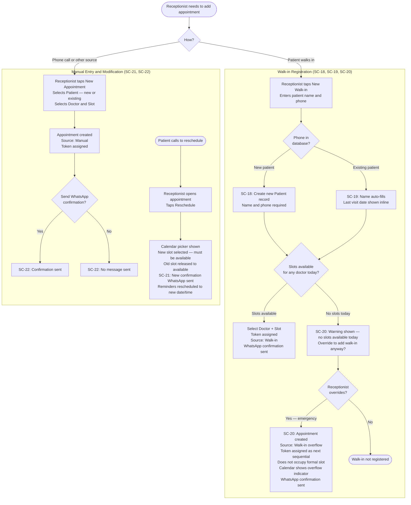

---

## 7. No-show and Post-Visit Flows (SC-23 through SC-26)

*Covers: marking no-show (SC-23), doctor adds visit note (SC-24), mark complete + record payment (SC-25), record as unpaid then pay later (SC-26).*

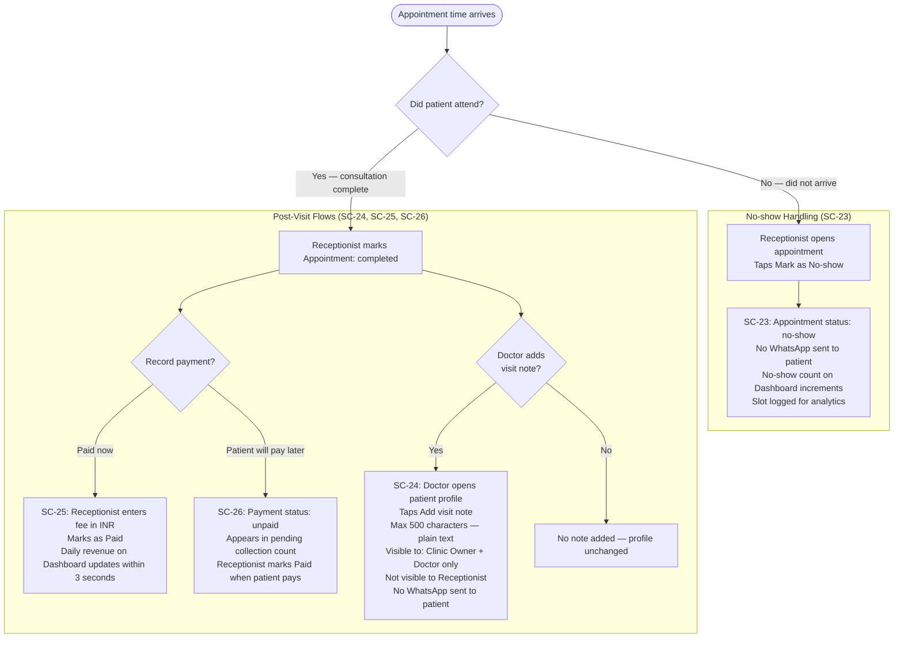

---

## 8. Reminder and Communication Failure — Sequence Diagram (SC-27 through SC-29)

*Covers: WhatsApp delivery failure triggers SMS fallback (SC-27), patient opts out and re-opts-in (SC-28), backend restart mid-conversation — state durability (SC-29).*

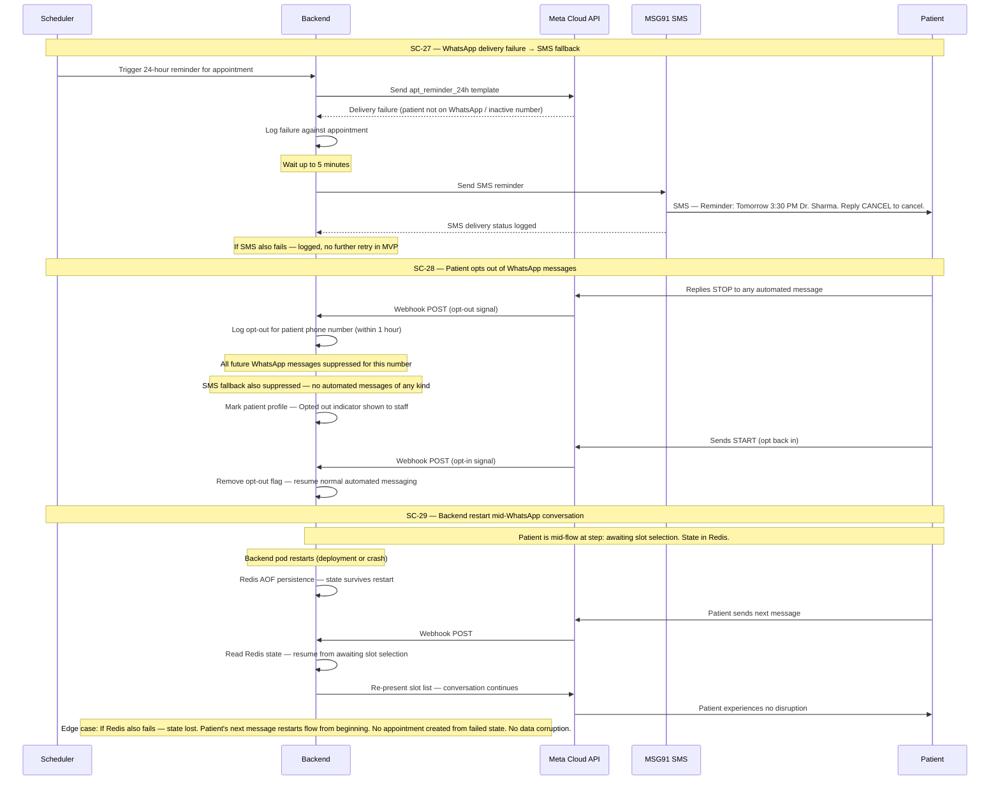

---

## 9. Capacity and Plan Limit Enforcement (SC-30 through SC-32)

*Covers: race condition — two simultaneous bookings on same slot (SC-30), Starter plan appointment limit hit (SC-31), WhatsApp message allowance exhausted (SC-32).*

```mermaid
flowchart TD
    subgraph RACE["SC-30 — Race Condition: Two Simultaneous Bookings"]
        RC_START([Two patients select same slot at the same second]) --> LOCK[Database write with optimistic locking]
        LOCK -->|First write succeeds| WIN[Patient A: Appointment confirmed<br>Token assigned — Slot: booked]
        LOCK -->|Second write detects conflict| LOSE[Patient B: That slot was just taken<br>Alternative slots presented<br>Both informed within 3 seconds<br>No double-booking — no data inconsistency]
    end

    subgraph APPT_LIMIT["SC-31 — Starter Plan Appointment Limit (500 per month)"]
        AL_START([Booking attempt on Starter plan]) --> AL_COUNT{Monthly appointment<br>count?}
        AL_COUNT -->|Below 450| AL_OK[Booking proceeds normally]
        AL_COUNT -->|Reaches 450 — 90 percent| AL_WARN[WhatsApp alert to Clinic Owner:<br>90% of monthly limit used — upgrade to Growth]
        AL_WARN --> AL_OK
        AL_COUNT -->|Reaches 500 — limit hit| AL_BLOCK[WhatsApp Booking Flow blocked:<br>Unable to accept online bookings. Please call clinic.<br>Web Booking Link: booking temporarily unavailable<br>Portal manual entry: still allowed with warning banner]
        AL_BLOCK --> AL_UPGRADE{Owner upgrades<br>or month resets?}
        AL_UPGRADE -->|Upgrades to Growth| AL_RESUME[Limit lifted immediately<br>All booking channels reactivated]
        AL_UPGRADE -->|Month resets| AL_RESUME
    end

    subgraph MSG_LIMIT["SC-32 — WhatsApp Message Allowance (Starter: 200 per month)"]
        ML_START([WhatsApp message sent]) --> ML_COUNT{Messages sent<br>this month?}
        ML_COUNT -->|Below 180| ML_OK[Messages continue normally]
        ML_COUNT -->|Reaches 180 — 90 percent| ML_WARN[WhatsApp alert to Clinic Owner:<br>90% of message allowance used]
        ML_WARN --> ML_OK
        ML_COUNT -->|Reaches 200 — limit hit| ML_PAUSE[Automated reminders paused<br>Booking confirmations continue — confirmations have priority]
        ML_PAUSE --> ML_OWNER[WhatsApp to Clinic Owner:<br>Message limit reached. Reminders paused.<br>Contact Cliniqly support to purchase top-up pack.]
        ML_OWNER --> ML_TOPUP{Top-up purchased<br>or month resets?}
        ML_TOPUP -->|Yes| ML_RESUME[Reminders resume immediately<br>Missed reminders not retroactively sent]
        ML_TOPUP -->|Month resets| ML_RESUME
    end
```

---

## 10. Clinic Onboarding and Setup (SC-33 through SC-36)

*Covers: first-time setup wizard (SC-33), skip WhatsApp step and complete later (SC-34), invite receptionist (SC-35), invite expires without acceptance (SC-36).*

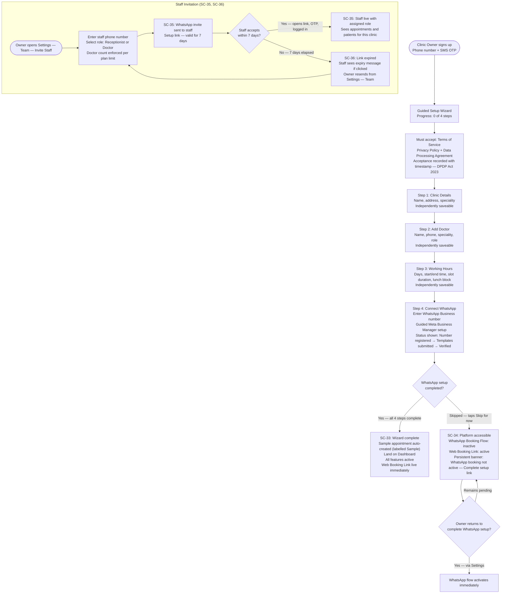

---

## 11. Multi-Role Access Control (SC-37 through SC-39)

*Covers: doctor accessing another doctor's patients (SC-37), receptionist accessing billing (SC-38), session expiry and re-authentication (SC-39).*

```mermaid
flowchart TD
    subgraph DOCTOR_ACCESS["SC-37 — Doctor Accessing Patient Records"]
        DA_START([Doctor navigates to a patient profile]) --> DA_CHK{Has this patient had<br>an appointment with this Doctor?}
        DA_CHK -->|Yes — own patient<br>OR shared patient at same clinic| DA_ALLOW[Access granted<br>Full profile shown<br>Other doctors' visit notes: read-only<br>Own visit notes: editable]
        DA_CHK -->|No — patient only visited other doctors| DA_DENY[HTTP 403 — profile not rendered<br>No restricted data in response<br>Access denied gracefully: No patients found]
    end

    subgraph RECEP_ACCESS["SC-38 — Receptionist Accessing Billing"]
        RA_START([Receptionist navigates to Billing section]) --> RA_CHK{Role check}
        RA_CHK -->|Receptionist role| RA_DENY[HTTP 403 — billing screen not rendered<br>You do not have permission to view this section]
        RA_CHK -->|Clinic Owner role| RA_ALLOW[Full billing access granted]
    end

    subgraph SESSION["SC-39 — Session Expiry and Re-authentication"]
        SE_START([Staff opens Cliniqly]) --> SE_CHK{Session valid?<br>Last login within 30 days?}
        SE_CHK -->|Valid — same trusted device| SE_OK[Auto-logged in<br>Calendar and patient list intact — no data loss]
        SE_CHK -->|Expired — 30+ days OR new browser| SE_REDIR[Redirected to login screen]
        SE_REDIR --> SE_OTP[Enter phone number<br>Receive 6-digit OTP via SMS<br>Max 3 failed attempts — 15 min lockout]
        SE_OTP --> SE_NEW[New 30-day session started<br>SC-39 complete]
    end

    subgraph TRUSTED["Trusted Device Definition"]
        TD_NOTE["Trusted device = valid HttpOnly session cookie<br>Clearing browser cookies = new device<br>Different browser = new device<br>New device always requires re-authentication"]
    end
```

---

## 12. Plan Trial and Upgrade (SC-40 through SC-41)

*Covers: 14-day trial expiry — soft paywall activates (SC-40), mid-month plan upgrade from Starter to Growth (SC-41).*

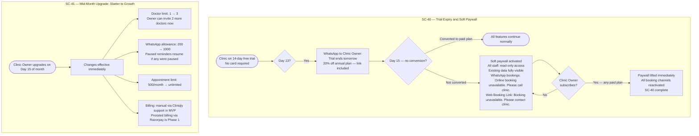

---

## 13. Reports and Exports (SC-42 through SC-50)

*Covers: daily appointment list PDF — owner and receptionist (SC-42, SC-43), patient visit history by doctor (SC-44), monthly revenue for accountant (SC-45), no-show analysis by channel (SC-46), doctor-wise performance (SC-47), new vs returning trend (SC-48), no data for period (SC-49), slow report — async fallback (SC-50).*

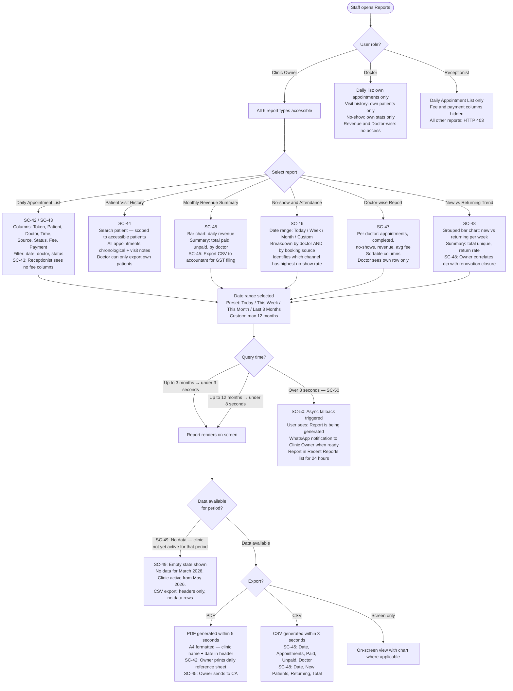

---

## 14. Role-Based Access (RBAC) Summary

| Capability | Clinic Owner | Doctor | Receptionist |
|---|---|---|---|
| View all appointments — all doctors | Yes | Own doctor only | Yes — all doctors |
| View all patients | Yes | Own patients only | Yes — all patients |
| Add visit note to completed appointment | Yes | Own appointments only | No |
| View visit notes | Yes | Own appointments only | No |
| Billing records and revenue | Yes | No | No |
| Clinic Settings | Yes | No | No |
| Invite and remove staff | Yes | No | No |
| **Daily Appointment List** | All doctors, all columns | Own appointments only | Own clinic — no fee/payment columns |
| **Patient Visit History export** | Any patient | Own patients only | No access |
| **Monthly Revenue Summary** | Full access | No access | No access |
| **No-show and Attendance report** | All doctors | Own stats only | No access |
| **Doctor-wise Report** | Full access | No access | No access |
| **New vs Returning Patient Trend** | Full access | No access | No access |

**Access enforcement rules:**
- Any restricted resource → HTTP 403, no restricted data in response body
- All data scoped to logged-in staff member's Clinic Tenant — cross-clinic access is impossible at DB layer (PostgreSQL Row-Level Security)
- Session: 30 days on trusted device; re-authentication required on new or unrecognised device
- Doctor plan limits: Starter 1 / Growth 3 / Pro 10 / Enterprise unlimited

---

*Cliniqly MVP — Scenarios SC-1 through SC-50 | PRD v1.0 (2026-06-07)*
*Source: prd.md §2.4 Extended Scenarios + §4 Features (FR-33, FR-44)*
